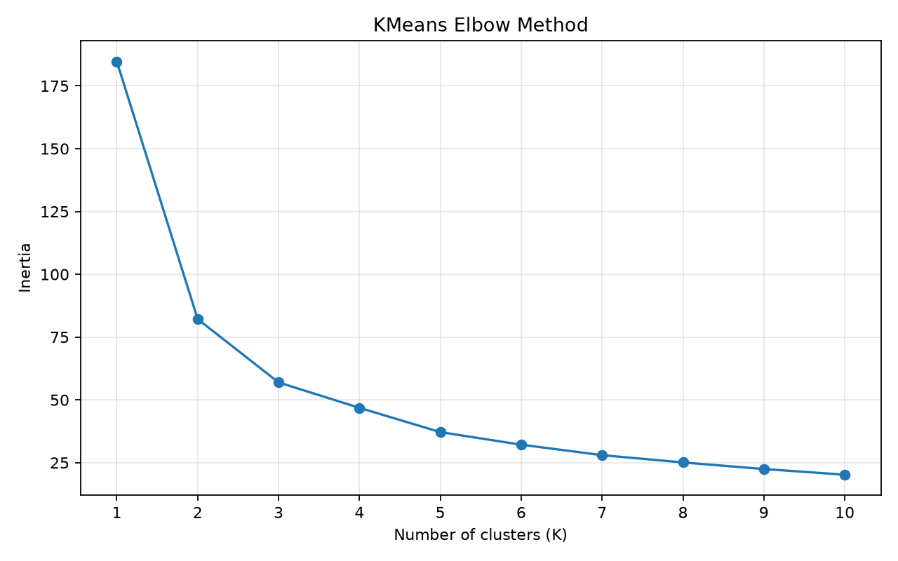
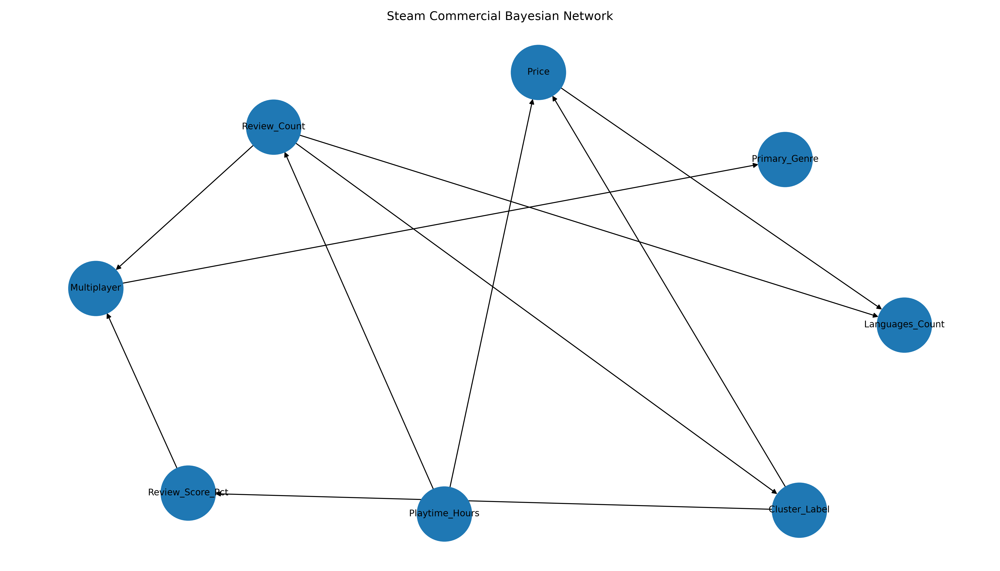

# IndieLaunch Pad: sistema intelligente per la valutazione commerciale di videogiochi indie su Steam

## Indice

- Capitolo 0 - Introduzione
- Capitolo 1 - Creazione del dataset e preprocessing
- Capitolo 2 - Apprendimento non supervisionato
- Capitolo 3 - Apprendimento supervisionato
- Capitolo 4 - Ragionamento probabilistico e rete bayesiana
- Capitolo 5 - Ragionamento logico e Knowledge Base Prolog
- Conclusioni
- Sviluppi futuri
- Riferimenti

## Capitolo 0 - Introduzione

L'obiettivo del progetto è realizzare un sistema di supporto alle decisioni per un publisher di videogiochi indipendenti. Il sistema simula il processo con cui un'etichetta di pubblicazione valuta una proposta commerciale: il publisher deve decidere se finanziare il gioco, richiedere una revisione del progetto oppure rifiutare la proposta.

La pipeline realizzata è:

```text
Dataset Steam
  -> preprocessing e feature engineering
  -> clustering KMeans
  -> classificazione supervisionata del profilo commerciale
  -> rete bayesiana per scenari incerti
  -> Knowledge Base Prolog
  -> verdetto finale del publisher
```

Il dominio scelto è quello dei giochi pubblicati su Steam. Sono stati esclusi testi liberi, descrizioni, recensioni testuali e immagini. Il sistema lavora su metadati tabulari, come prezzo, genere, recensioni aggregate, numero di lingue, playtime e categorie Steam.

### Scelta progettuale generale

La scelta principale del progetto è stata costruire un sistema integrato invece di limitarsi a un singolo modello predittivo. Una semplice classificazione avrebbe permesso di assegnare un'etichetta a un gioco, ma non avrebbe mostrato come tale risultato possa essere usato in un processo decisionale più ampio. Per questo motivo la pipeline collega quattro livelli:

- il clustering scopre profili commerciali non definiti a priori;
- la classificazione supervisionata impara a riconoscere tali profili;
- la rete bayesiana valuta scenari incerti e relazioni probabilistiche;
- Prolog applica regole aziendali esplicite e produce il verdetto finale.

Sono state escluse impostazioni alternative come sistemi di raccomandazione, analisi del testo delle recensioni o classificazione di immagini promozionali. Queste alternative sarebbero state interessanti, ma avrebbero spostato il progetto verso altri temi meno centrali e avrebbero richiesto componenti NLP o computer vision.

### Requisiti funzionali

Il sistema deve:

- costruire un dataset pulito a partire dal CSV Steam;
- individuare profili commerciali latenti tramite clustering;
- usare i cluster come target per addestrare modelli supervisionati;
- valutare i modelli con risultati mediati su più run;
- modellare scenari incerti con una rete bayesiana;
- integrare output di ML e rischio probabilistico in una KB Prolog;
- produrre un verdetto finale interpretabile.

### Strumenti utilizzati

Il progetto è realizzato in Python. Le librerie principali sono:

- `pandas` e `numpy` per caricamento e manipolazione dei dati;
- `scikit-learn` per preprocessing, clustering e modelli supervisionati;
- `imbalanced-learn` per SMOTE;
- `matplotlib` e `seaborn` per grafici e visualizzazioni;
- `pgmpy` per la rete bayesiana;
- `pyswip` e SWI-Prolog per l'integrazione con Prolog.

per avere tutto il necessario eseguire lo script:

```text
pip install -r requirements.txt
```

### File di configurazione centrale

Il progetto utilizza un modulo dedicato (`config.py`) che centralizza tutti i parametri condivisi dalla pipeline. Questo file svolge il ruolo di Single Source of Truth: percorsi dei dataset, nomi dei file di output, parametri degli algoritmi di Machine Learning, soglie utilizzate dalla rete bayesiana e regole di business per la Knowledge Base Prolog sono definiti in un unico punto.

Questa scelta progettuale offre diversi vantaggi. Innanzitutto migliora la manutenibilità del codice, poiché eventuali modifiche ai parametri globali possono essere effettuate senza intervenire nei singoli script della pipeline. Inoltre garantisce maggiore coerenza tra i moduli, riducendo il rischio di utilizzare configurazioni diverse nelle varie fasi del progetto. Infine favorisce la riproducibilità degli esperimenti, poiché tutti gli script condividono gli stessi percorsi, lo stesso seed casuale e le stesse impostazioni operative.

Il file contiene in particolare:

- percorsi dei dataset e dei file generati durante l'esecuzione;
- parametri di preprocessing e campionamento;
- configurazioni del clustering KMeans;
- parametri di validazione e addestramento dei modelli supervisionati;
- soglie utilizzate dalla rete bayesiana per classificare il rischio;
- vincoli di business impiegati dalla Knowledge Base Prolog;
- definizione delle feature utilizzate nelle diverse fasi della pipeline.

In questo modo ogni componente del sistema rimane indipendente dal punto di vista implementativo, ma continua a condividere una configurazione comune e coerente con l'intero progetto.

### Struttura del progetto e avvio

La struttura operativa è:

| Cartella          | Contenuto                                                   |
| ----------------- | ----------------------------------------------------------- |
| `data/raw/`       | dataset originale                                           |
| `data/processed/` | dataset puliti, normalizzati, discretizzati e clusterizzati |
| `src/`            | script Python della pipeline                                |
| `kb/`             | regole Prolog e fatti generati                              |
| `results/`        | metriche, grafici, query e verdetti                         |
| `docs/`           | documentazione                                              |
| `models/`         | miglior modello apprendimento supervisionato                |

Gli script principali sono eseguiti nel seguente ordine:

```text
src/preprocessing.py
src/clustering.py
src/supervised_learning.py
src/bayesian_network.py
src/prolog_reasoning.py
```

## Capitolo 1 - Creazione del dataset e preprocessing

### Dataset scelto

Il dataset usato è "Steam Games Dataset" di fronkongames, disponibile su Kaggle. La scelta è motivata dai seguenti aspetti:

- contiene un numero ampio di giochi Steam;
- fornisce dati tabulari già adatti all'analisi quantitativa;
- include variabili commerciali utili per il problema del publisher;
- permette di evitare testo libero e immagini.

Il file originale contiene 122611 righe. Per il progetto non è stato usato l'intero dataset in tutte le fasi: dopo pulizia e filtri viene estratto un campione riproducibile di 5000 giochi. La scelta del campionamento è progettuale: consente di mantenere tempi di esecuzione contenuti e rende gestibili clustering, cross-validation e apprendimento della rete bayesiana.

Sono stati considerati anche dataset più piccoli e già puliti, come raccolte limitate ai giochi più popolari. Tali dataset avrebbero semplificato il preprocessing, ma avrebbero ridotto la varietà dei profili commerciali e reso meno interessante la fase di clustering. Il dataset scelto richiede invece una fase di pulizia più attenta, ma permette di lavorare su un mercato più ampio e realistico.

### Correzione dell'intestazione

Durante la prima lettura del CSV è emersa un'anomalia: nell'intestazione compare il campo `DiscountDLC count`, mentre nelle righe dati `Discount` e `DLC count` sono due colonne separate. Se il file viene letto senza correzione, tutte le colonne successive risultano sfalsate.

La funzione `build_corrected_header` in `src/preprocessing.py` legge l'intestazione originale, sostituisce il campo fuso con due nomi distinti e passa questa lista a `pandas.read_csv`. In questo modo la correzione non dipende da modifiche manuali al file e può essere rieseguita in ogni ambiente.

### Feature selection e feature engineering

Dal dataset originale vengono selezionate e derivate le feature necessarie alle fasi successive. Le principali sono:

| Feature | Origine | Uso nel progetto |
|---|---|---|
| `Primary_Genre` | primo valore di `Genres` | clustering, classificazione, rete bayesiana, Prolog |
| `Price` | prezzo Steam | clustering, classificazione, rete bayesiana, Prolog |
| `Review_Count` | `Positive + Negative` | volume di interesse commerciale |
| `Review_Score_Pct` | `Positive / (Positive + Negative)` | ricezione utente |
| `Playtime_Hours` | playtime medio in minuti convertito in ore | durata stimata |
| `Languages_Count` | conteggio di `Supported languages` | vincolo di localizzazione |
| `Multiplayer` | derivato da `Categories` | feature commerciale e rischio |

`Review_Count` e `Review_Score_Pct` sono particolarmente importanti perché rappresentano due aspetti diversi: il primo misura il volume di attenzione ricevuta dal gioco, il secondo misura la qualità percepita dagli utenti.

Sono state escluse feature accessorie come piattaforme supportate, età richiesta, raccomandazioni e stima dei possessori. La scelta riduce la complessità del progetto e mantiene solo variabili direttamente collegate alla decisione commerciale che il publisher deve prendere.

La selezione finale privilegia quindi poche feature ma direttamente giustificabili:

- prezzo, per il posizionamento commerciale;
- recensioni, per volume e ricezione;
- playtime, per stimare l'offerta di contenuto;
- genere, per la coerenza commerciale;
- lingue e multiplayer, per vincoli e rischio di publishing.

### Filtri applicati

Sono stati rimossi:

- record senza nome;
- record senza genere;
- giochi con meno di 20 recensioni totali;
- giochi con prezzo fuori dall'intervallo 0-100;
- duplicati su `AppID`.

Il filtro sulle recensioni evita che il clustering sia dominato da giochi con pochissime informazioni di mercato. Il filtro sul prezzo rimuove outlier non rappresentativi per il caso d'uso di un publisher indie.

### Normalizzazione e discretizzazione

Vengono prodotti tre dataset:

- `steam_games_clean.csv`: dataset pulito con feature derivate;
- `steam_games_normalized.csv`: dataset normalizzato;
- `steam_games_discretized.csv`: dataset discretizzato.

La normalizzazione viene usata per KMeans e SVM, poichè entrambi sono sensibili alla scala delle feature. Senza normalizzazione, `Review_Count` potrebbe dominare variabili come prezzo e durata.

La discretizzazione viene usata per la rete bayesiana. Variabili continue con molti valori distinti produrrebbero CPD sparse e poco gestibili. La discretizzazione in stati basso, medio e alto rende invece l'inferenza più stabile e interpretabile.

La normalizzazione è implementata con `MinMaxScaler`, mentre la discretizzazione usa `KBinsDiscretizer` con strategia `quantile`. La strategia quantile è stata preferita a una suddivisione uniforme perchè alcune variabili, come il numero di recensioni, hanno distribuzioni molto sbilanciate: pochi giochi accumulano moltissime recensioni, mentre la maggioranza resta su valori più bassi. Con i quantili, i bin risultano più popolati e quindi più utili per stimare probabilità nella rete bayesiana.

## Capitolo 2 - Apprendimento non supervisionato

### Obiettivo del clustering

Il clustering serve a individuare profili commerciali latenti nel mercato Steam. Non viene usato come fase isolata, ma come passaggio intermedio:

- i cluster diventano il target della fase supervisionata;
- la KB Prolog usa direttamente le caratteristiche pre-lancio dei giochi dimostrativi;
- la rete bayesiana include `Cluster_Label` tra le variabili.

### Feature usate

Il KMeans viene applicato alle feature:

- `Price`;
- `Review_Score_Pct`;
- `Review_Count`;
- `Playtime_Hours`.

La scelta è legata al significato commerciale delle variabili: prezzo, ricezione, volume di recensioni e durata descrivono meglio di altre feature il profilo di mercato di un gioco.

Non sono state incluse feature categoriche nel clustering per mantenere lo spazio geometrico più semplice e interpretabile. Inserire direttamente il genere avrebbe richiesto codifica one-hot, aumentando la dimensionalità e rendendo meno chiara l'interpretazione dei centroidi. Il genere viene comunque recuperato nella sintesi dei cluster, osservando il genere più frequente per ciascun gruppo.

### Perché KMeans e non altri algoritmi

KMeans è stato scelto per tre ragioni:

- produce centroidi facilmente interpretabili tramite medie delle feature;
- è adatto a dati numerici normalizzati;
- consente di usare l'Elbow Method per motivare il numero di cluster.

Sono state considerate alternative come clustering gerarchico e DBSCAN. Il clustering gerarchico avrebbe prodotto una struttura più ricca, ma meno immediata da riutilizzare come target supervisionato in una pipeline compatta. DBSCAN avrebbe potuto individuare outlier, ma richiede una scelta di `eps` e `min_samples`; inoltre, su dati di mercato con densità molto variabile, rischia di produrre molti punti rumore o cluster difficili da usare come classi. Per il nostro obiettivo, cioè creare profili commerciali latenti riutilizzabili in classificazione e Prolog, KMeans è risultato più lineare e documentabile.

### Scelta del numero di cluster

Il numero di cluster è stato valutato tramite Elbow Method per valori di `K` da 1 a 10. I risultati sono salvati in `results/kmeans_elbow.csv` e il grafico in `results/kmeans_elbow.png`.



Il valore scelto è `K = 3`. La scelta è coerente sia con la curva del gomito sia con l'obiettivo interpretativo del progetto: distinguere giochi con ricezione molto positiva, giochi intermedi e giochi a rischio commerciale più alto.

Parametri principali:

- `K = 3`;
- `n_init = 10`;
- `max_iter = 300`;
- seed fisso per riproducibilita.

Nel codice, la fase è implementata in `src/clustering.py`, nello specifico:

- carica dataset pulito, normalizzato e discretizzato;
- esegue l'Elbow Method sul dataset normalizzato;
- applica KMeans con `SELECTED_K = 3`;
- infine copia la colonna `Cluster_Label` in tutti i dataset processati.

Questa scelta evita disallineamenti tra dataset usati da modelli diversi.

### Risultati del clustering

La tabella dei centroidi interpretati è:

| Cluster | Giochi | Prezzo medio | Review score medio | Recensioni mediane | Playtime medio | Interpretazione              |
| ------- | -----: | -----------: | -----------------: | -----------------: | -------------: | ---------------------------- |
| 0       |   2437 |        6.620 |             89.993 |                639 |         18.380 | ricezione molto positiva     |
| 1       |    757 |        4.215 |             48.602 |                143 |          6.374 | rischio commerciale più alto |
| 2       |   1806 |        5.243 |             73.197 |                303 |         10.170 | ricezione intermedia         |

Il cluster 0 presenta la migliore ricezione media, con review score superiore al 90%. Il cluster 1 ha review score molto più basso e minore playtime medio, quindi viene interpretato come profilo a maggiore rischio. Il cluster 2 rappresenta una fascia intermedia: non è un fallimento netto, ma neppure un profilo fortemente positivo.

L'output di questa fase è salvato nei dataset clusterizzati, in particolare `steam_games_normalized_clustered.csv`.

## Capitolo 3 - Apprendimento supervisionato

### Obiettivo

La fase supervisionata deve predire il profilo commerciale di un gioco usando come target `Cluster_Label` in uno scenario pre-lancio. A differenza della fase di clustering, il classificatore non usa `Review_Count` e `Review_Score_Pct`, perché queste variabili derivano dalle recensioni osservate dopo la pubblicazione.

Questa scelta rende il compito più difficile ma più realistico per un publisher: il modello prova a riconoscere il profilo commerciale latente usando soltanto informazioni disponibili o stimabili prima del lancio, cioè prezzo, genere, playtime stimato, numero di lingue e presenza del multiplayer.

### Feature e target

Il dataset usato è `steam_games_normalized_clustered.csv`. Il target è `Cluster_Label`.

Le feature usate sono:

- `Primary_Genre`;
- `Price`;
- `Playtime_Hours`;
- `Languages_Count`;
- `Multiplayer`.

`Primary_Genre` viene codificato tramite one-hot encoding dentro la pipeline, cosi la trasformazione avviene in modo coerente durante cross-validation e training. `Review_Count` e `Review_Score_Pct` restano utili per costruire e interpretare i cluster, ma vengono esclusi dall'input supervisionato per evitare una valutazione non realistica in fase pre-lancio.

### Modelli e iperparametri

Sono stati confrontati Random Forest e SVM.

La scelta di confrontare questi due modelli è legata alla loro natura diversa. Random Forest è un modello ensemble robusto su feature eterogenee e capace di modellare relazioni non lineari senza richiedere forti assunzioni sulla distribuzione dei dati. SVM, invece, rappresenta una macchina a kernel/margine che permette di verificare se una separazione geometrica nello spazio normalizzato è sufficiente a distinguere i cluster.

Non è stata scelta una regressione logistica come modello principale perché i cluster non sono necessariamente separabili linearmente e il confronto con SVM lineare copre già una parte di questa ipotesi.

Per Random Forest sono stati ricercati:

- `n_estimators`: 100, 200;
- `max_depth`: `None`, 10, 20;
- `min_samples_leaf`: 1, 3.

Per SVM sono stati ricercati:

- `C`: 0.1, 1, 10;
- `kernel`: `rbf`, `linear`;
- `gamma`: `scale`.

La griglia è stata mantenuta compatta per rispettare i tempi del progetto, ma sufficiente a confrontare modelli con capacita diverse.

L'ottimizzazione viene implementata con `GridSearchCV`. Per ogni modello vengono testate le combinazioni della griglia e la configurazione finale viene scelta usando F1 macro come metrica di refit. Questa scelta è coerente con il problema: non interessa massimizzare soltanto l'accuracy complessiva, ma mantenere buone prestazioni anche sulla classe minoritaria, che corrisponde al profilo a maggiore rischio commerciale.

### Valutazione

La valutazione usa `RepeatedStratifiedKFold` con:

- 5 fold;
- 3 ripetizioni;
- seed fisso.

Le metriche riportate sono:

- accuracy;
- precision macro;
- recall macro;
- F1 macro.

La scelta di metriche macro è motivata dalla presenza di classi non perfettamente bilanciate. In particolare, la distribuzione è:

| Cluster | Esempi | Percentuale |
|---|---:|---:|
| 0 | 2437 | 48.74% |
| 1 | 757 | 15.14% |
| 2 | 1806 | 36.12% |

Per questo motivo ogni modello viene valutato anche con SMOTE. SMOTE è inserito dentro la pipeline di cross-validation: viene applicato solo al training fold, evitando data leakage.

SMOTE non viene applicato prima della cross-validation perché ciò introdurrebbe informazioni sintetiche derivate anche dai dati che dovrebbero restare nel fold di validazione. Nel codice, l'uso di `imblearn.pipeline.Pipeline` garantisce che oversampling, preprocessing e training siano ripetuti correttamente all'interno di ogni split.

### Risultati

I risultati numerici della variante pre-lancio sono salvati in `results/supervised_metrics.csv` e `results/supervised_best_params.csv`..

Risultati mediati su 5 fold ripetuti 3 volte:

| Modello | SMOTE | Accuracy | Precision macro | Recall macro | F1 macro |
|---|---|---:|---:|---:|---:|
| Random Forest | No | 0.4947 +/- 0.0168 | 0.4316 +/- 0.0189 | 0.4139 +/- 0.0148 | 0.4153 +/- 0.0155 |
| Random Forest | Si | 0.4659 +/- 0.0149 | 0.4305 +/- 0.0122 | 0.4488 +/- 0.0126 | 0.4298 +/- 0.0125 |
| SVM | No | 0.4966 +/- 0.0104 | 0.4908 +/- 0.0658 | 0.3638 +/- 0.0093 | 0.3220 +/- 0.0134 |
| SVM | Si | 0.3925 +/- 0.0148 | 0.3975 +/- 0.0151 | 0.4184 +/- 0.0139 | 0.3695 +/- 0.0136 |

Migliori parametri trovati:

| Modello | SMOTE | Parametri migliori |
|---|---|---|
| Random Forest | No | `max_depth=20`, `min_samples_leaf=1`, `n_estimators=100` |
| Random Forest | Si | `max_depth=20`, `min_samples_leaf=3`, `n_estimators=200` |
| SVM | No | `C=10`, `gamma=scale`, `kernel=rbf` |
| SVM | Si | `C=10`, `gamma=scale`, `kernel=rbf` |

Il miglior valore di F1 macro è ottenuto da Random Forest con SMOTE, pari a 0.4298 +/- 0.0125. La versione senza SMOTE ottiene accuracy leggermente più alta, ma F1 macro inferiore: questo indica che, nello scenario pre-lancio, bilanciare la classe minoritaria aiuta soprattutto la valutazione media sulle classi, anche se riduce la correttezza complessiva.

SVM risulta meno adatto in questa configurazione. Senza SMOTE mantiene accuracy simile alla Random Forest, ma ha F1 macro molto più basso; con SMOTE migliora il bilanciamento tra classi, ma non raggiunge la Random Forest.

Il risultato va interpretato con cautela: il target supervisionato è stato generato dal clustering e non rappresenta una ground truth esterna. Tuttavia, l'esclusione delle recensioni dall'input supervisionato rende la valutazione piu interessante, perche misura quanto prezzo, genere, playtime, lingue e multiplayer siano sufficienti per avvicinarsi ai profili commerciali scoperti nella fase non supervisionata.

## Capitolo 4 - Ragionamento probabilistico e rete bayesiana

### Obiettivo

La rete bayesiana viene usata per ragionare in condizioni di incertezza. Il classificatore supervisionato pre-lancio assegna un profilo commerciale, mentre la rete bayesiana permette di interrogare scenari parziali, ad esempio:

- cosa succede se il prezzo è alto?
- il multiplayer aumenta il rischio di recensioni basse?
- quale cluster è più probabile dato un certo genere e un certo prezzo?

La rete bayesiana non sostituisce il classificatore supervisionato pre-lancio. Il suo ruolo è diverso: mentre Random Forest e SVM restituiscono una predizione di cluster, la rete bayesiana permette di ragionare su dipendenze probabilistiche e su variabili non completamente osservate. Questo è più vicino a una situazione decisionale reale, in cui il publisher conosce alcune caratteristiche del gioco ma non conosce ancora la ricezione finale degli utenti.

### Dataset e variabili

La rete usa `steam_games_discretized_clustered.csv`. Le variabili sono:

- `Primary_Genre`;
- `Price`;
- `Review_Score_Pct`;
- `Review_Count`;
- `Playtime_Hours`;
- `Languages_Count`;
- `Multiplayer`;
- `Cluster_Label`.

Le variabili numeriche sono discretizzate in stati 0, 1, 2, interpretati come basso, medio e alto. Questa discretizzazione evita problemi di memoria e CPD molto sparse.

Per le variabili categoriche, come `Primary_Genre`, il codice esporta anche una legenda in `results/category_mappings.csv`. Questa tabella permette di tradurre stati numerici come `Primary_Genre=1` nel genere testuale corrispondente, evitando che le query bayesiane restino leggibili solo dal punto di vista del software.

Non e stata usata una rete bayesiana continua per due motivi. Il primo è pratico: molte implementazioni discrete, come quelle usate in `pgmpy`, richiedono stati enumerabili per stimare CPD gestibili. Il secondo è interpretativo: stati come prezzo basso, medio e alto sono più facilmente traducibili in regole decisionali e in commenti per il publisher rispetto a valori continui molto frammentati.

### Apprendimento della struttura e dei parametri

La struttura viene appresa tramite HillClimbSearch con score BIC. è stato imposto `max_indegree = 3`, cosi ogni nodo può avere al massimo tre genitori. La scelta limita la complessità della rete e rende più leggibili le dipendenze apprese.

I parametri vengono appresi con l'estimatore discreto compatibile con la versione installata di `pgmpy`.

Sono state considerate due alternative: definire manualmente la struttura della rete oppure apprenderla automaticamente. La struttura manuale avrebbe permesso di imporre relazioni intuitive, ad esempio prezzo e durata verso review score. Tuttavia avrebbe rischiato di riflettere solo assunzioni progettuali. Lo structure learning consente invece di ottenere una rete guidata dai dati.

Nel codice, questa parte è implementata in `src/bayesian_network.py`. Lo script carica il dataset discretizzato e clusterizzato, apprende la struttura con HillClimbSearch, stima le CPD e salva sia gli archi appresi sia le query in formato CSV. Sono stati gestiti anche cambiamenti di API tra versioni di `pgmpy`, usando `DiscreteBayesianNetwork` e `DiscreteMLE` quando disponibili.

### Struttura appresa

| Sorgente           | Destinazione       |
| ------------------ | ------------------ |
| `Price`            | `Languages_Count`  |
| `Review_Score_Pct` | `Multiplayer`      |
| `Multiplayer`      | `Primary_Genre`    |
| `Review_Count`     | `Languages_Count`  |
| `Review_Count`     | `Multiplayer`      |
| `Review_Count`     | `Cluster_Label`    |
| `Cluster_Label`    | `Review_Score_Pct` |
| `Cluster_Label`    | `Price`            |
| `Playtime_Hours`   | `Review_Count`     |
| `Playtime_Hours`   | `Price`            |


Gli archi più utili per il problema sono `Review_Count -> Cluster_Label`, `Cluster_Label -> Review_Score_Pct` e `Playtime_Hours -> Review_Count`, perché collegano comportamento commerciale, ricezione e durata.

Alcuni archi non vanno letti come causalità certa, ma come dipendenze probabilistiche apprese sui dati. Ad esempio, `Cluster_Label -> Price` non significa che il cluster causi il prezzo nel mondo reale, ma significa che, nella distribuzione osservata, prezzo e cluster risultano statisticamente collegati secondo la struttura appresa. Nella relazione vengono quindi usati come supporto interpretativo, non come dimostrazione causale.

### Inferenza

Risultati principali:

| Query | Stato | Probabilita |
|---|---:|---:|
| `P(Cluster_Label | Primary_Genre=1, Price=2)` | 0 | 0.5765 |
| `P(Cluster_Label | Primary_Genre=1, Price=2)` | 1 | 0.1014 |
| `P(Cluster_Label | Primary_Genre=1, Price=2)` | 2 | 0.3222 |
| `P(Cluster_Label | Price=0, Playtime_Hours=2)` | 0 | 0.3847 |
| `P(Cluster_Label | Price=0, Playtime_Hours=2)` | 1 | 0.2146 |
| `P(Cluster_Label | Price=0, Playtime_Hours=2)` | 2 | 0.4008 |
| `P(Review_Score_Pct | Price=2, Multiplayer=1)` | 0 | 0.3139 |
| `P(Review_Score_Pct | Price=2, Multiplayer=1)` | 1 | 0.3636 |
| `P(Review_Score_Pct | Price=2, Multiplayer=1)` | 2 | 0.3226 |

La legenda esportata in `results/category_mappings.csv` permette di leggere `Primary_Genre=1` come `Action`. Quindi la prima query valuta giochi di genere Action con prezzo alto (`Price=2`): il cluster più probabile è il cluster 0, cioè il profilo con ricezione molto positiva. La seconda query mostra invece che un gioco economico ma con playtime alto si distribuisce soprattutto tra cluster 2 e cluster 0, quindi tra profilo intermedio e positivo.

La query sul prezzo alto e multiplayer è rilevante per il publisher: la probabilità di review score basso è circa 31.39%, mentre lo stato medio e il più probabile. Questo risultato suggerisce che, in uno scenario con prezzo alto e componente multiplayer, esiste un rischio da monitorare, ma non dominante rispetto agli altri stati di ricezione.

## Capitolo 5 - Ragionamento logico e Knowledge Base Prolog

### Obiettivo

La KB Prolog rappresenta il regolamento interno del publisher. Il suo compito non e ricevere direttamente una decisione gia calcolata, ma derivare un verdetto partendo da caratteristiche note o stimabili prima della pubblicazione:

- genere principale;
- prezzo previsto;
- durata stimata;
- numero di lingue supportate;
- presenza del multiplayer;

Oltre a queste caratteristiche intrinseche, la KB riceve in input anche i risultati probabilistici dei livelli precedenti: la predizione del cluster (dal Random Forest) e la stima del rischio (dalla Rete Bayesiana). Questa scelta rende la KB coerente con lo scenario decisionale pre-lancio: le recensioni finali (review score) non sono note, ma il sistema le "stima", delegando poi a Prolog l'applicazione di vincoli aziendali invalicabili. Il sistema produce tre possibili verdetti:

- `approvato`;
- `revisione`;
- `rifiutato`.

### Rappresentazione della conoscenza

I fatti principali sono ora:

```prolog
gioco(Nome, Genere, Prezzo, OreStimate, Lingue, Multiplayer).
predizione_commerciale(Nome, Cluster).
rischio_bayesiano(Nome, LivelloRischio).
```

Le regole sono mantenute in `kb/publisher_rules.pl`. La separazione tra regole e fatti è una scelta implementativa cruciale:

- le regole (codificate a mano) rappresentano la governance aziendale invalicabile;
- i fatti rappresentano i dati della proposta di gioco e le predizioni dei modelli di AI;
- Prolog fonde questi due mondi per derivare il verdetto finale

### Regole implementate

La KB contiene regole per:

- supporto globale: almeno 3 lingue;    
- supporto premium: almeno 5 lingue;
- prezzo alto o basso;
- coerenza tra genere e durata stimata;
- profilo commerciale derivato: successo, intermedio o rischio;
- rischio accettabile, medio o critico;
- violazioni bloccanti;
- approvazione, revisione e rifiuto.

Le soglie principali sono definite come fatti Prolog generati da Python: prezzo alto, prezzo basso e soglie minime di localizzazione. Non sono più presenti soglie di review score, poiché non sono note prima della pubblicazione.

Esempio di logica decisionale ibrida:

- un gioco viene **approvato** se il modello ML lo inserisce in un cluster di successo, ha un rischio bayesiano basso, e contemporaneamente soddisfa vincoli di supporto lingue premium e coerenza genere-durata;
- un gioco richiede **revisione** se è coerente e localizzato, ma presenta indicatori di rischio medio (es. prezzo alto o cluster intermedio);
- un gioco viene **rifiutato** se presenta una violazione bloccante: queste spaziano da fattori umani (localizzazione insufficiente, incoerenza tra genere e durata) a previsioni algoritmiche estremamente negative (rischio bayesiano alto).

La regola di coerenza genere-durata evita che la KB si limiti a confrontare valori isolati. Ad esempio, un RPG con durata molto bassa viene considerato incoerente rispetto alle aspettative commerciali del genere, mentre un puzzle game può essere coerente anche con una durata più breve.

### Perché la KB non e pattern matching

L'aspetto centrale di questa architettura è che Prolog agisce come un manager validatore. Non si fida ciecamente dei modelli di Machine Learning, ma li subordina a regole di business. Ad esempio:

- `verdetto/2` dipende da catene di regole quali `approva_finanziamento/1` o `violazione_bloccante/2`;
- `approva_finanziamento/1` esige il superamento di requisiti aziendali stringenti (es. `supporto_premium/1`) oltre ad un esito favorevole delle AI (`predizione_commerciale/2` e `rischio_bayesiano/2`).
- `violazione_bloccante/2` astrae cause diverse di rifiuto: un gioco predestinato al successo dall'algoritmo verrà inesorabilmente scartato da Prolog se fallisce i requisiti di localizzazione (`localizzazione_insufficiente`) o risulta irrealistico (`incoerenza_genere`).

Questa ibridazione risolve il problema delle "black-box" del Machine Learning: il sistema sfrutta l'Intelligenza Artificiale per generalizzare pattern complessi sui dati, ma garantisce al publisher l'ultima parola tramite una logica deduttiva, interpretabile e totalmente deterministica.

### Risultati dimostrativi

I quattro casi sono stati scelti per coprire comportamenti diversi senza inserire nei fatti la decisione attesa:

| **Gioco**                    | **Cluster** | **Rischio Bayes.** | **Profilo** | **Verdetto** | **Violazioni**          |
| ---------------------------- | ----------- | ------------------ | ----------- | ------------ | ----------------------- |
| `stellar_strategy_master`    | cluster_0   | basso              | successo    | approvato    | -                       |
| `short_puzzle_deluxe`        | cluster_0   | basso              | medio       | revisione    | -                       |
| `underlocalized_action`      | cluster_2   | alto               | rischio     | rifiutato    | localizzazione; rischio |
| `overpriced_multiplayer_rpg` | cluster_2   | alto               | rischio     | rifiutato    | incoerenza; rischio     |
- **`stellar_strategy_master`**: Il gioco rispetta tutti i parametri di business ed è supportato da una predizione ML di successo e un profilo di rischio basso, portando all'**approvazione** automatica.
- **`short_puzzle_deluxe`**: Sebbene il cluster sia promettente (`cluster_0`), il sistema assegna lo stato di **revisione** perché il profilo di rischio è solo "medio" (dovuto al prezzo elevato), obbligando a una valutazione umana prima di procedere.
- **`underlocalized_action`**: Nonostante appartenga a un cluster commerciale discreto, il gioco viene **rifiutato** per due violazioni bloccanti: la localizzazione è insufficiente (sotto la soglia minima) e il rischio bayesiano è troppo elevato.
- **`overpriced_multiplayer_rpg`**: Verdetto di **rifiuto** netto. Oltre al rischio critico, il sistema ha rilevato un'incoerenza logica (genere/durata/prezzo) che invalida la proposta commerciale a prescindere dalle potenzialità del genere.

Dopo l'esecuzione di `src/prolog_reasoning.py`, i verdetti vengono salvati in `results/prolog_decisions.csv`.

### Complessita della KB

Il ragionamento Prolog usa risoluzione SLD su clausole di Horn. Nel progetto il numero di fatti e regole e contenuto, quindi il costo delle query e basso. Tuttavia, in generale, la complessita cresce con:

- numero di giochi rappresentati;
- numero di regole alternative per ciascun verdetto;
- uso di negazione come fallimento;
- numero di condizioni concatenate nelle regole.

La KB e modulare: nuovi vincoli del publisher possono essere aggiunti introducendo nuove clausole, senza modificare clustering, classificazione o rete bayesiana.
## Conclusioni

Il progetto quindi realizza un sistema integrato di supporto alle decisioni, formato da:
- Il clustering produce profili commerciali;
- la classificazione supervisionata riconosce il profilo assegnato dalla fase non supervisionata;
- la rete bayesiana ragiona su scenari incerti;
- la KB Prolog applica vincoli aziendali espliciti per produrre un verdetto.

Le alternative più complesse, come modelli neurali, NLP sulle recensioni o recommender systems, sono state volutamente escluse. L'obiettivo non era massimizzare la complessita tecnica, ma costruire una pipeline coerente con i temi del corso e con il vincolo temporale del progetto. La scelta di pochi metadati commerciali, modelli interpretabili e regole esplicite rende il sistema più facile da comprendere, valutare ed estendere.

## Sviluppi futuri

Possibili estensioni:

- generare i fatti Prolog direttamente da una proposta inserita dall'utente;
- collegare automaticamente le probabilita bayesiane a livelli di rischio basso, medio e alto;
- aggiungere una piccola interfaccia per simulare scenari di investimento;
- testare la stabilita dei cluster su campioni diversi;
- introdurre ulteriori regole commerciali, ad esempio vincoli di piattaforma o requisiti per festival indie;

## Riferimenti

- Dataset: Kaggle, "Steam Games Dataset", fronkongames.
- Python: pandas, numpy, scikit-learn, imbalanced-learn.
- Rete bayesiana: pgmpy.
- Ragionamento logico: SWI-Prolog e pyswip.
- Output sperimentali: cartella `results/`.
